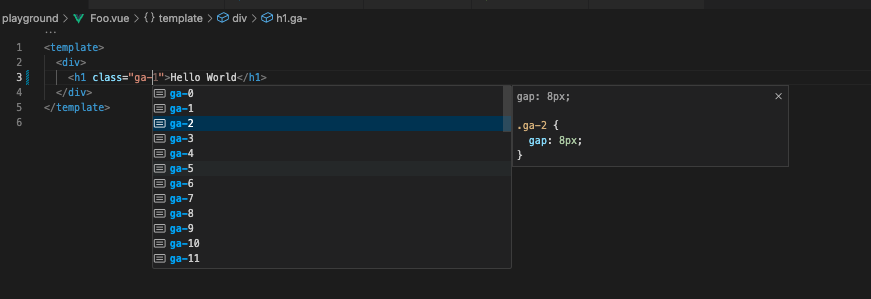

# vuetify-tailwind-utility-bridge

**Tailwind CSS plugin** that brings Vuetify-style utility classes to your project.  
Enables Figma design token alignment, Tailwind auto-completion, and incremental migration from Vuetify to Tailwind.

A Tailwind CSS plugin that provides Vuetify-like utility classes — for autocomplete support and progressive migration from Vuetify to Tailwind.

## ✨ Purpose

This package is designed with **two main use cases**:

### 1. Autocomplete support for Vuetify utility classes in VSCode

- Enables Tailwind CSS IntelliSense (autocomplete) for Vuetify utility classes like `.ma-1`, `.text-primary`, `.elevation-4`, etc.
  - [see Vuetify utilities](https://vuetifyjs.com/en/styles/borders/#usage)
- This does **not require Tailwind CSS to be installed in your project.**
- This was the **original motivation** behind creating this plugin — enabling autocomplete even in a Vuetify-only project.

#### 🛠 Recommended VSCode settings

Add the following to your `.vscode/settings.json`:

```json
{
  "tailwindCSS.includeLanguages": {
    "vue": "html",
    "plaintext": "html"
  },
  "editor.quickSuggestions": {
    "strings": true
  }
}
```

## ✨ Features

- 🔧 Provides Vuetify-style utility classes (`.d-flex`, `.ma-2`, `.rounded-lg`, etc.)
- 🎨 Maps Vuetify design tokens to Tailwind utility conventions
- 🧩 Enables Tailwind IntelliSense / autocomplete in VSCode
- 📦 Lightweight and framework-agnostic plugin
- 🪜 Perfect for incremental migration from Vuetify to Tailwind
- Theme injection (only Colors)

## Unsupported Features

- RTL mode
- Expand css variables (e.g. `var(–v-hover-opacity);`)
- partial typography utilities(see src/generated/vuetifyUtilities.ts)

---

## 📦 Installation

```bash
npm install vuetify-tailwind-utility-bridge
```

---

## 🛠 Usage

1. Add [Tailwind CSS IntelliSense](https://marketplace.visualstudio.com/items?itemName=bradlc.vscode-tailwindcss) in your VSCode
2. Add this plugin on your tailwindcss.config.js
   1. You don't need to install tailwindcss if you want to use this module for autocompletion.

```js
const vuetifyUtilityBridgePlugin = require('vuetify-tailwind-utility-bridge');

/** @type {import('tailwindcss').Config} */
module.exports = {
  corePlugins: [],
  content: ['**/*.vue', '**/*.js', '**/*.ts'],
  plugins: [vuetifyUtilityBridgePlugin.vuetifyPlugin()],
  // or your Vuetify theme (theme: Vuetify ThemeDefinition)
  // plugins: [vuetifyUtilityBridgePlugin.vuetifyPlugin(theme)],
};
```



---

## 🚀 Use Case

- Bring **Tailwind-class auto-completion** to Vuetify-based components
- Use it as a **design token bridge** between Vuetify and Figma
- **Gradually refactor** Vuetify components into Tailwind

---

## 📄 License

MIT
